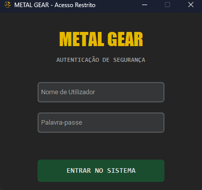
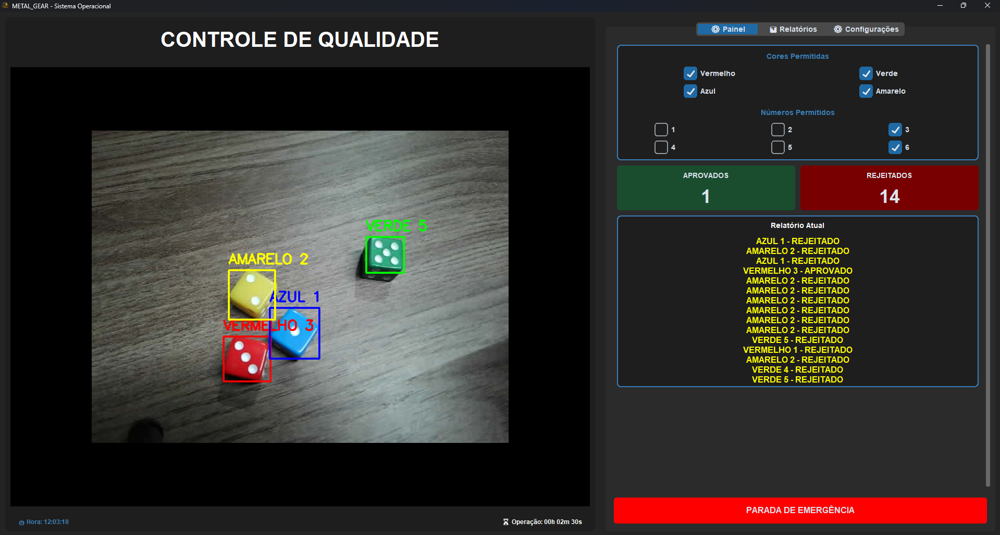
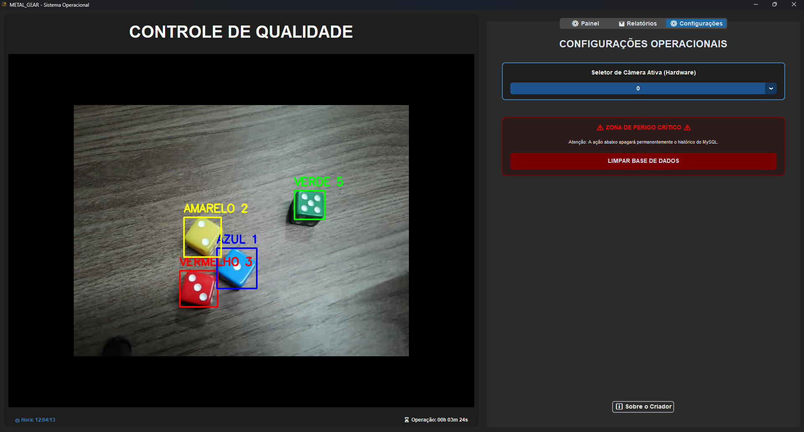
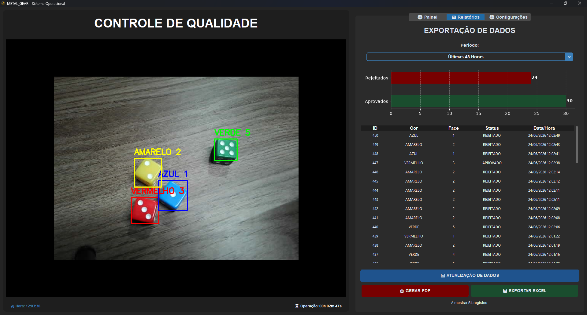
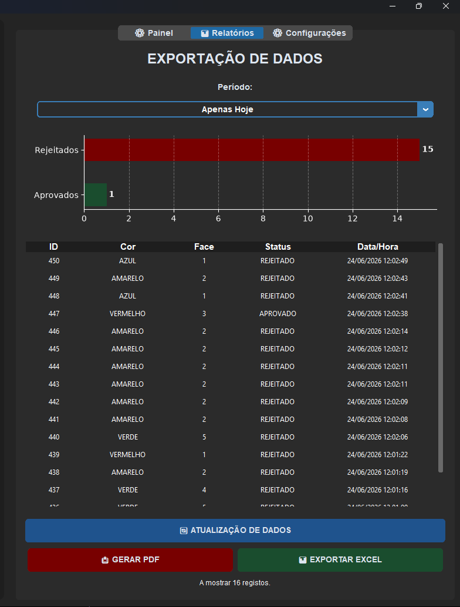
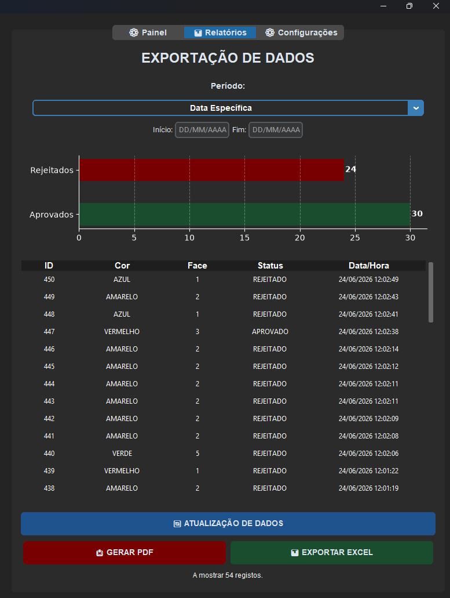
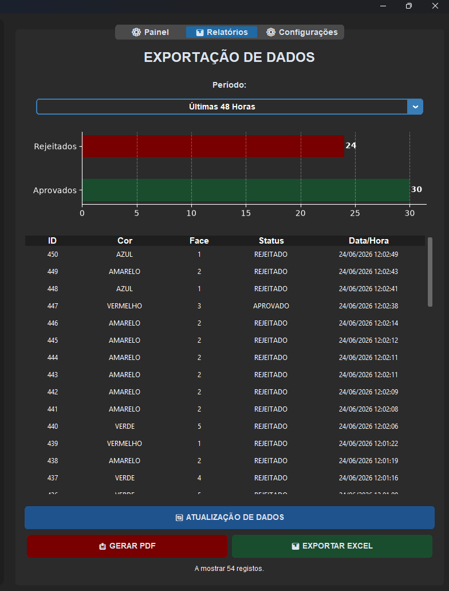
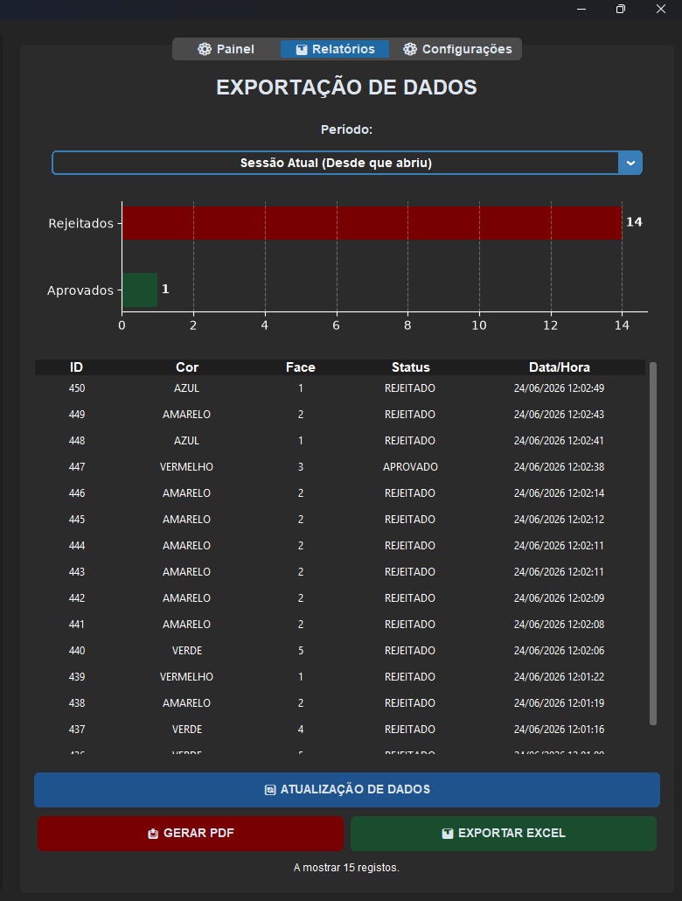
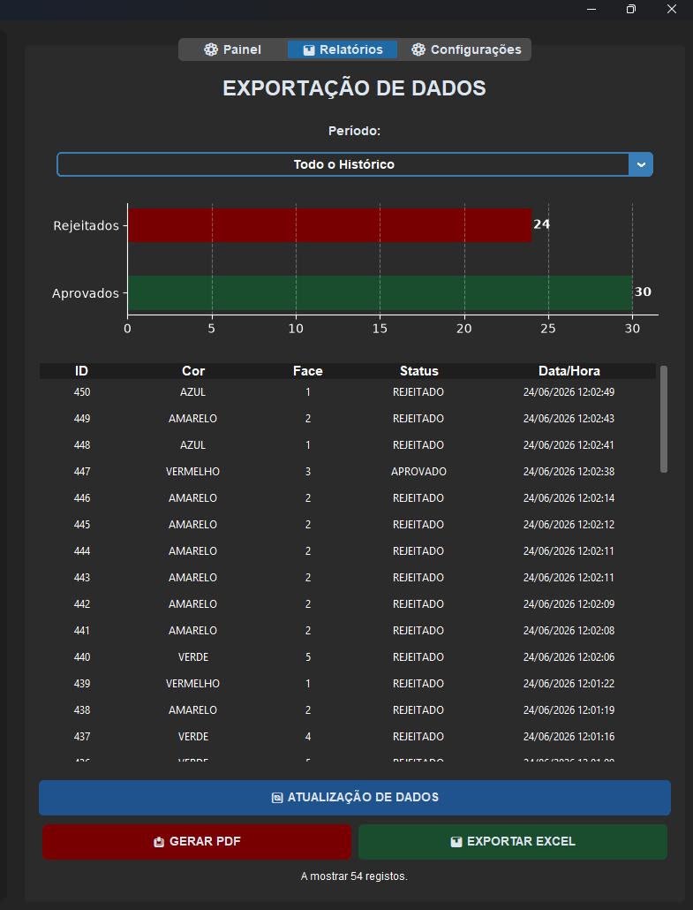
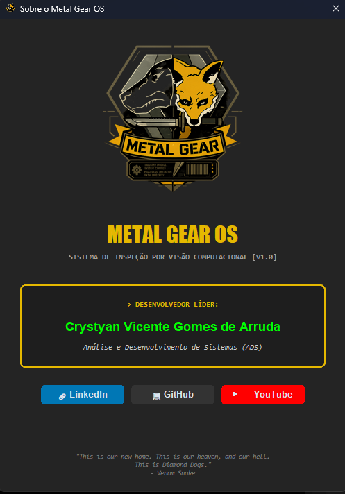

# Metal Gear OS - Sistema de Inspeção Visual Tática

Olá! Bem-vindo ao repositório do Metal Gear OS. Muito mais do que um simples projeto de faculdade, este sistema é o culminar da minha paixão pela Engenharia de Software e pela robótica, mesclando visão computacional, gestão de dados e uma interface imersiva inspirada em Metal Gear.

Desenvolvi este software do zero com um objetivo claro em mente: criar uma solução de controle de qualidade que não apenas funcionasse com precisão industrial, mas que também fosse intuitiva, segura e visualmente estimulante para o operador.

---

# A Visão por Trás do Projeto
Num ambiente de produção industrial, a precisão e a rapidez são fundamentais. O Metal Gear OS foi projetado para atuar como o "olho digital" de uma esteira de produção. O sistema utiliza uma câmara (webcam ou módulo de câmara industrial) para observar peças em tempo real, analisando a sua cor e número identificador. Com base em regras rigorosas definidas pelo administrador, a IA decide instantaneamente se a peça é aprovada ou rejeitada, mantendo um registo imaculado de cada evento.

---

# Funcionalidades Principais
* **Visão Computacional em Tempo Real (OpenCV):** O núcleo do sistema. Captura frames de vídeo contínuos, isola as áreas de interesse e processa a deteção de cor e forma numa fração de segundo.
* **Interface Tática e Responsiva (CustomTkinter):** Abandonei os designs monótonos. A interface foi cuidadosamente esculpida com botões reativos, cores institucionais (com o clássico amarelo e cinzento militar) e painéis modulares, oferecendo uma experiência de utilizador fluida e moderna.
* **Registo Histórico Imutável (MySQL):** Cada peça que cruza a lente da câmara é catalogada numa base de dados relacional (MySQL). O sistema regista a hora exata, as características detetadas e a decisão (Aprovado/Rejeitado).
* **Módulo de Relatórios e Exportação:** A informação só tem valor se for acessível. O software permite filtrar o histórico por datas específicas e exportar relatórios completos e profissionais diretamente para PDF ou planilhas CSV.
* **Sistema de Autenticação Multinível:** A segurança é prioritária. O sistema restringe o acesso através de uma tela de login com permissões distintas para Administradores (controlo total e alteração de regras) e Operadores (apenas supervisão).
* **"Caixa Preta" de Logs:** Como manda a boa engenharia, o sistema inclui um módulo de rastreio que regista meticulosamente eventos, erros e inícios de sessão num ficheiro local, crucial para auditorias e debugging.

---

# O Stack Tecnológico & Dependências

| Área | Tecnologias & Bibliotecas |
| **Linguagem Core** | Python 3 |
| **Visão Computacional** | OpenCV (`opencv-python==4.13.0.92`), NumPy (`numpy==2.5.0`) |
| **Interface Gráfica (GUI)** | CustomTkinter (`customtkinter==5.2.2`), PIL (`Pillow==12.2.0`) |
| **Base de Dados** | MySQL, `mysql-connector-python` |
| **Relatórios e Dados** | FPDF (`fpdf==1.7.2`), Matplotlib (`matplotlib==3.11.0`) |

---

# Interface em Ação

**O portal seguro para o sistema:**

**O feed da câmara em tempo real e a análise das peças:**

**Ajuste de regras dinâmicas e acesso restrito:**

**Acesso ao histórico e emissão de documentos:**

**Diferentes filtros avançados para exportação de dados:**

**Creditos:**

---

# Como Executar o Projeto na Sua Máquina

Para rodar o **Metal Gear OS** no seu ambiente local, siga o procedimento operacional padrão:

1. **Clonagem do Repositório:**
   
   git clone https://github.com/crys001001/METAL-GEAR-OS.git
   cd METAL-GEAR-OS

2.Instalação das Dependências:
Para garantir a estabilidade e a compatibilidade do sistema, utilizamos um ambiente gerido rigorosamente via requirements.txt. O projeto foi homologado com as seguintes versões:

Plaintext
customtkinter==5.2.2
fpdf==1.7.2
matplotlib==3.11.0
mysql-connector-python
numpy==2.5.0
opencv-python==4.13.0.92
Pillow==12.2.0

Execute o seguinte comando no terminal para instalar as bibliotecas:

Bash
pip install -r requirements.txt
Configuração da Infraestrutura (MySQL):

Servidor Local: Certifique-se de que o seu serviço MySQL (via XAMPP, WAMP ou instalação nativa) está ativo e a correr.

Instanciação do Schema: Navegue até à pasta DATABASE e importe o script metal_gear_schema.sql para o seu gestor de base de dados preferido (como MySQL Workbench ou phpMyAdmin). Isto criará as tabelas de histórico automaticamente.

Ajuste de Credenciais: no ficheiro BACK_END/BANCO_DE_DADOS.py.

Execução:
Com o ambiente montado e a base de dados a postos, inicie o motor de inspeção tática no terminal:

Bash
python MAIN.py

O Próximo Nível (Fase 2: Integração Industrial)
O Metal Gear OS que temos agora é o cérebro da operação. A Fase 2 focará na ponte entre o virtual e o mundo físico:

Comunicação de Hardware: Estabelecer a comunicação em tempo real do motor em Python com microcontroladores (como a família Arduino e ESP32).

Automação Eletromecânica: Implementar o controle de atuadores e motores DC (via sinais PWM e Pontes H) para controlar a velocidade da esteira e executar a separação física automática das peças que a IA aprovar ou rejeitar.

Sobre o Desenvolvedor
O meu nome é Crystyan Vicente Gomes de Arruda. Sou estudante de Análise e Desenvolvimento de Sistemas (ADS) e um grande entusiasta de sistemas ciber-físicos. O meu foco atual é dominar a intersecção entre a Inteligência Artificial (Visão Computacional) e a Engenharia de Hardware para criar soluções que otimizem processos na indústria real.
